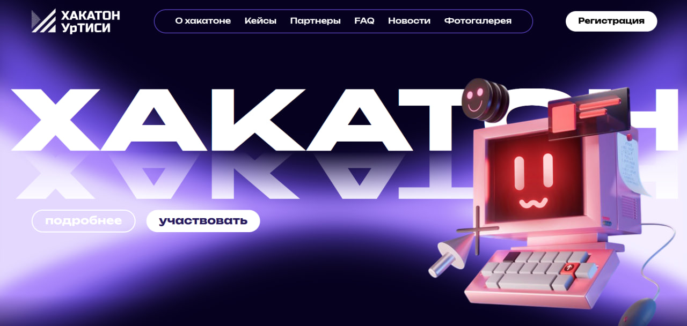

<p align="center">
  <a href="https://www.python.org/" title="Python"></a>
  &nbsp;&nbsp;
  <a href="https://fastapi.tiangolo.com/" title="FastAPI"></a>
  &nbsp;&nbsp;
  <a href="https://react.dev/" title="React"></a>
  &nbsp;&nbsp;
  <a href="https://www.typescriptlang.org/" title="TypeScript"></a>
  &nbsp;&nbsp;
  <a href="https://www.postgresql.org/" title="PostgreSQL"></a>
  &nbsp;&nbsp;
  <a href="https://www.docker.com/" title="Docker"></a>
  &nbsp;&nbsp;
  <a href="https://nginx.org/" title="Nginx"></a>
  &nbsp;&nbsp;
  <a href="https://resend.com/" title="Resend"></a>
  &nbsp;&nbsp;
  <a href="https://yandex.ru/support/metrica/" title="Яндекс Метрика"></a>
</p>

<p align="center">  </p>

# Всероссийский хакатон связи

## Задача

Разработать веб-систему для проведения мероприятия «Всероссийский хакатон связи», обеспечивающую информирование участников о мероприятии, регистрацию команд и централизованное управление содержимым и заявками через защищённую административную панель.

## Описание проекта

**«Всероссийский хакатон связи»** – мероприятие, которое проходит в течение четырёх дней в Екатеринбурге под руководством Института связи УрТИСИ (филиал СибГУТИ). Оно направлено на то, чтобы привлечь студентов участвовать в решении актуальных задач в области телекоммуникаций и информационных технологий.

Данная система представляет собой веб-приложение для проведения этого мероприятия. Система состоит из двух основных компонентов:
* **информационный сайт** - публичная часть системы, предназначенная для информирования пользователей о мероприятии и регистрации команд для участия в нём;
* **административная панель** - защищённая часть системы для централизованного управления содержимым сайта, регистрациями участников, статистикой и аналитикой мероприятия.

## Основной функционал

* просмотр информации о мероприятии: партнёры, кейсы, новости, отзывы, фотогалерея, программа хакатона, часто задаваемые вопросы и контакты;
* регистрация команд и участников на мероприятие;
* административная панель предоставляет полный набор функций для управления содержимым сайта и регистрациями мероприятия;
* просмотр статистики мероприятия, получение данных о посещаемости сайта, анализ пользовательской активности;
* восстановление пароля администратора через отправку электронных писем;
* безопасность: защита REST API от неавторизованного доступа, JWT-аутентификация администратора, хеширование паролей в БД, разграничение доступа между публичной и административной частями системы.

## Архитектура системы

Система построена по **клиент-серверной архитектуре**:
```text
                         Пользователь
                              │
                              ▼
                             HTTP
                              │
                              ▼
                         Nginx (SSL) 
                              │
                              ▼
                        React, TypeScript
                              │
                              ▼
                           REST API
                              │
                              ▼
                           FastAPI
                 ┌────────────┼─────────────┐
                 ▼            ▼             ▼
            PostgreSQL     Resend     Яндекс.Метрика
```

### Стек
* **Backend** - FastAPI, Python;
* **Frontend** - React, TypeScript;
* **База данных** - PostgreSQL;
* **Веб-сервер и обратный прокс** - Nginx;
* **Контейнеризация** - Docker;
* **Resend** - отправка электронных писем при восстановлении пароля администратора;
* **Яндекс Метрика** - сбор статистики посещаемости и аналитики пользовательского поведения на сайте.

### Работа системы
* каждый основной компонент системы развёрнут в отдельном Docker-контейнере;
* информационный сайт и административная панель реализованы в составе одного приложения: публичная часть доступна по основному URL, а административная панель - по пути /admin. Обе части используют общие frontend- и backend-компоненты и единую базу данных PostgreSQL.
* взаимодействие frontend-приложения с backend-сервисом реализовано через REST API;
* nginx используется в качестве веб-сервера и reverse proxy: принимает внешние HTTP/HTTPS-запросы, обеспечивает SSL/TLS и маршрутизирует запросы к соответствующим сервисам.

## Развертывание

Инструкция по развёртыванию находится в файле **Деплой.md**.

## Репозиторий

[GitHub](https://github.com/gudvill/hakaton_uisi)

## Авторы

**Гудвилл Алексей Максимович**

Backend-разработка, проектирование и реализация серверной части, разработка REST API, проектирование базы данных, реализация аутентификации и механизмов защиты административной панели, интеграция внешних сервисов.

**Коновалова Софья Дмитриевна**

Frontend-разработка, разработка пользовательского интерфейса информационного сайта и административной панели, адаптивная вёрстка, реализация взаимодействия интерфейса с backend API.